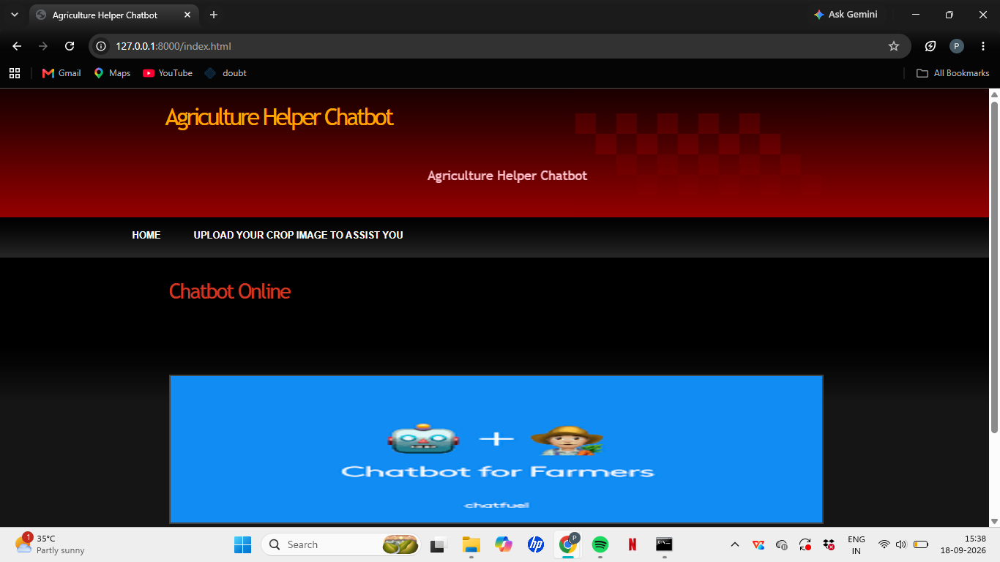
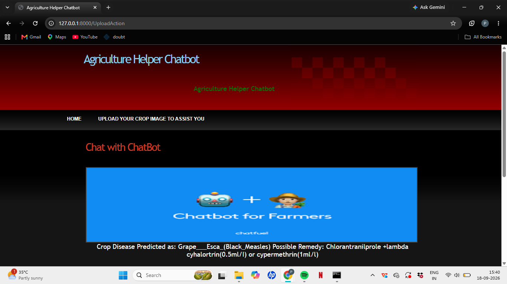
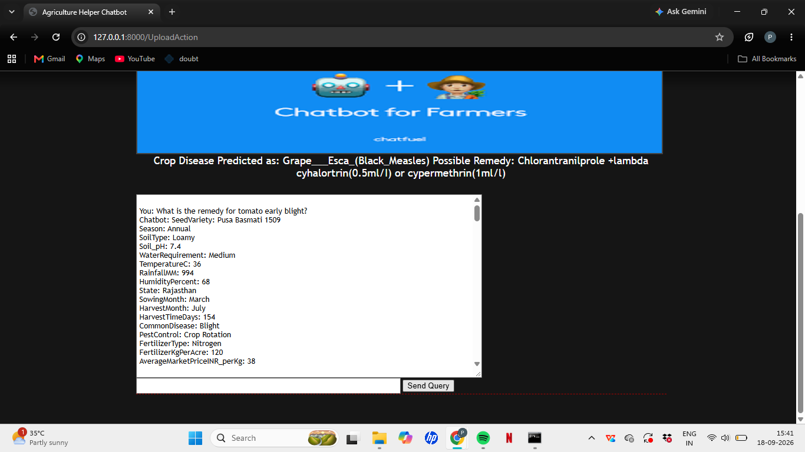

# An Intelligent CNN and NLP Based Agriculture Helper Chatbot

A Django-based agriculture assistant that combines **image-based crop disease prediction** with a **text-based agriculture chatbot**.

### Overview

The Agriculture Helper Chatbot is a web-based application developed using Django. It combines image-based crop disease prediction with a text-based agriculture chatbot.

The system provides two main functionalities:

1. **Crop Disease Prediction** – Users can upload a crop image, and the trained CNN model predicts the crop disease.
2. **Agriculture Chatbot** – Users can enter agriculture-related questions and receive relevant information and possible remedies.

### Key Features

- **Crop Disease Prediction** – Upload a crop image and get a predicted crop disease using the trained CNN model.
- **Disease Remedy Information** – Get possible remedies related to the predicted crop disease.
- **Agriculture Chatbot** – Ask agriculture-related questions and receive relevant responses.
- **Crop and Seed Information** – Provides information about crops, seed varieties, seasons, soil requirements, water requirements, and other available crop details.
- **Web-Based Interface** – Provides a simple web interface for interacting with the chatbot and disease prediction system.

### System Workflow

The application works through the following process:

1. The user opens the Django web application.
2. For disease prediction, the user uploads a crop image.
3. The uploaded image is processed and passed to the trained CNN model.
4. The model predicts the crop disease.
5. The application retrieves possible remedy information for the predicted disease.
6. Alternatively, the user can enter an agriculture-related question in the chatbot.
7. The chatbot processes the query and returns a relevant response.

### CNN-Based Crop Disease Detection

The application uses a trained Convolutional Neural Network (CNN) model for crop disease classification.

The uploaded image is:

1. Resized to **64 × 64 pixels**.
2. Converted into a numerical array.
3. Normalized by scaling pixel values between **0 and 1**.
4. Passed to the trained CNN model.
5. The model produces probabilities for **25 crop disease classes**.
6. The class with the highest predicted probability is selected as the result.

### NLP-Based Agriculture Chatbot

The application includes a text-based chatbot that uses Natural Language Processing (NLP) techniques to match user queries with available agriculture-related responses.

The chatbot:

1. Converts the user's query to lowercase and removes extra spaces.
2. Checks for direct matches with the available questions.
3. Uses **TF-IDF (Term Frequency-Inverse Document Frequency)** to represent text queries.
4. Calculates **Cosine Similarity** between the user's query and the available questions.
5. Selects the response associated with the most similar question.
6. Returns a default message when a suitable response cannot be found.

### Technologies Used

- **Programming Language:** Python
- **Web Framework:** Django
- **Machine Learning / Deep Learning:** TensorFlow, Keras
- **Natural Language Processing:** TF-IDF, Cosine Similarity
- **Computer Vision:** OpenCV
- **Data Processing:** Pandas, NumPy
- **Database:** SQLite
- **Frontend:** HTML, CSS, JavaScript

### Project Structure

```text
AgriChatbot/
│
├── Chatbot/                         # Django project configuration
│   ├── settings.py
│   ├── urls.py
│   └── wsgi.py
│
├── ChatBotApp/                      # Main Django application
│   ├── static/                      # CSS and image assets
│   ├── templates/                   # HTML templates
│   ├── views.py                     # Application logic
│   ├── urls.py                      # Application URLs
│   └── ...
│
├── Messages/                        # Chatbot and agriculture datasets
│   ├── diseases.txt
│   └── agriculture_chatbot_200_crops_real_seeds.csv
│
├── model/                           # Trained CNN model
│   ├── model.json
│   └── model_weights.h5
│
├── testImages/                      # Sample images for testing
│
├── manage.py                         # Django management script
├── requirements.txt                  # Python dependencies
├── runServer.bat                     # Windows script to start the server
└── .gitignore                        # Git ignored files

``` 
### Installation & Setup

1. Clone the repository:

```bash
git clone https://github.com/Prasanna-P25/An-Intelligent-CNN-and-NLP-based-Agriculture-Helper-Chatbot.git
```
### How to Run
After completing the installation steps, run the Django development server:

```bash
python manage.py runserver
```
Then open the application in a web browser at:

```text
http://127.0.0.1:8000/
```
On Windows, the included `runServer.bat` file can also be used to start the Django development server.
### How to Use

#### Crop Disease Prediction

1. Open the application.
2. Navigate to the crop disease prediction section.
3. Upload a crop image.
4. Submit the image for prediction.
5. The application displays the predicted crop disease and a possible remedy.

#### Agriculture Chatbot

1. Open the chatbot section.
2. Enter an agriculture-related question.
3. Submit the query.
4. The chatbot processes the question and displays a relevant response.
### Screenshots

#### Home Page


#### Crop Disease Prediction


#### Agriculture Chatbot

### Future Improvements

- Improve the chatbot to handle a wider range of agriculture-related queries.
- Expand the crop disease dataset and prediction classes.
- Improve the accuracy of crop disease prediction with a larger and more diverse image dataset.
- Enhance the user interface and overall user experience.
- Deploy the application so that it can be accessed online.
